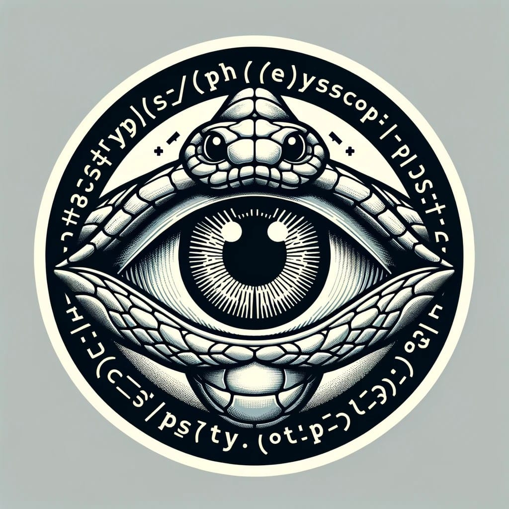
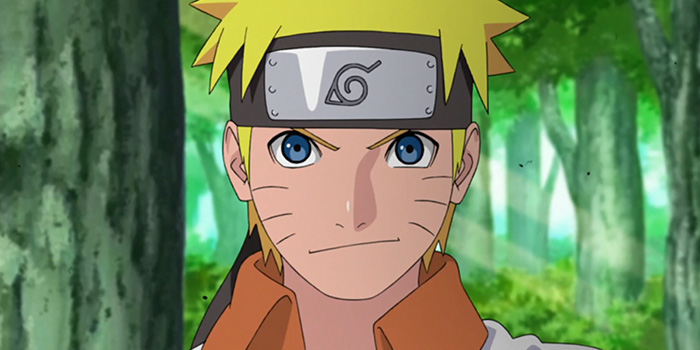
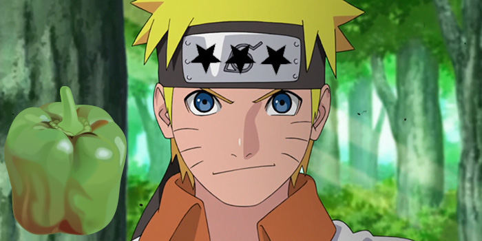
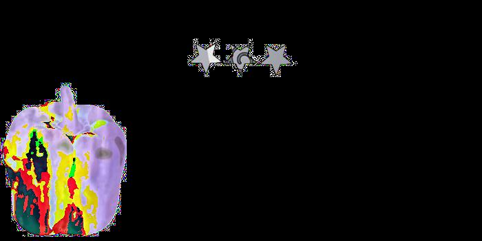
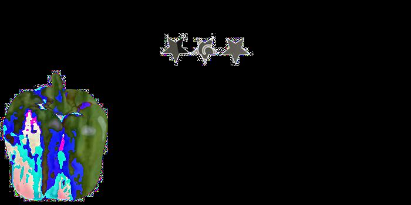
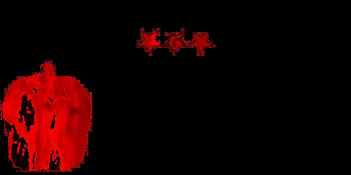
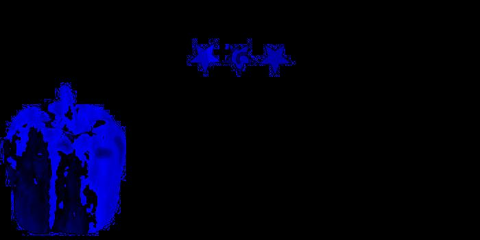
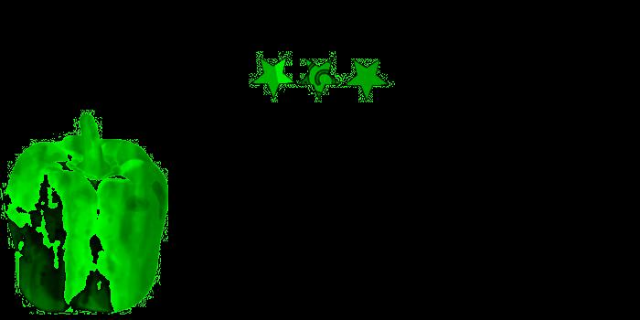
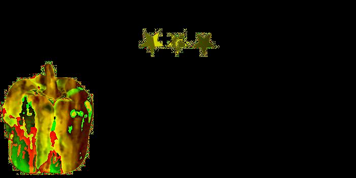

# ByakuganVisualizer



The ByakuganVisualizer repository hosts a Python tool designed to compare images and highlight their differences. 
It simplifies the process of identifying disparities between images, making it ideal for tasks like testing and quality 
assurance. Additionally, it offers options for customization, which can be helpful for color-blind users.


## Usage 

```
usage: byakugan_vision [-h] [--version] --diff DIFF [--filter {red,blue,green,yellow}] [--out_dir OUT_DIR]

ByakuganVisualizer: Tool for comparing images and highlighting differences.

options:
  -h, --help            show this help message and exit
  --version             show program's version number and exit
  --diff DIFF           String containing a list of tuples "Path_To_Image1a,Path_To_Image2a;Path_To_Image1b,Path_To_Image2b...". Each tuple contains two paths to images to be compared.
  --filter {red,blue,green,yellow}
                        Filter type (red, blue, green, yellow)
  --out_dir OUT_DIR     Output directory for the difference images

```

## Example

The left image used in the example is from the following source:
https://www.anime2you.de/news/606180/naruto-feiert-20-anime-jubilaeum/

<div style="display: flex; flex-direction: row;">
    
    
</div>

### Difference with no Filter

```bash
byakugan_vision --diff "tests/test_images/naruto.jpg,tests/test_images/naruto_modified.jpg" --out_dir tests/test_images/diff
```



Note: The output depends on the order of the images in the tuple. The first image is subtracted from the second image.
That is why the following command results in a different output:

```bash
byakugan_vision --diff "tests/test_images/naruto_modified.jpg,tests/test_images/naruto.jpg" --out_dir tests/test_images/diff
```




### Red Filtered Difference

```bash
byakugan_vision --diff "tests/test_images/naruto.jpg,tests/test_images/naruto_modified.jpg" --filter red --out_dir tests/test_images/diff
```



### Blue Filtered Difference

```bash
byakugan_vision --diff "tests/test_images/naruto.jpg,tests/test_images/naruto_modified.jpg" --filter blue --out_dir tests/test_images/diff
```



### Green Filtered Difference

```bash
byakugan_vision --diff "tests/test_images/naruto.jpg,tests/test_images/naruto_modified.jpg" --filter green --out_dir tests/test_images/diff
```



### Yellow Filtered Difference

```bash
byakugan_vision --diff "tests/test_images/naruto.jpg,tests/test_images/naruto_modified.jpg" --filter yellow --out_dir tests/test_images/diff
```

