# ByakuganVisualizer

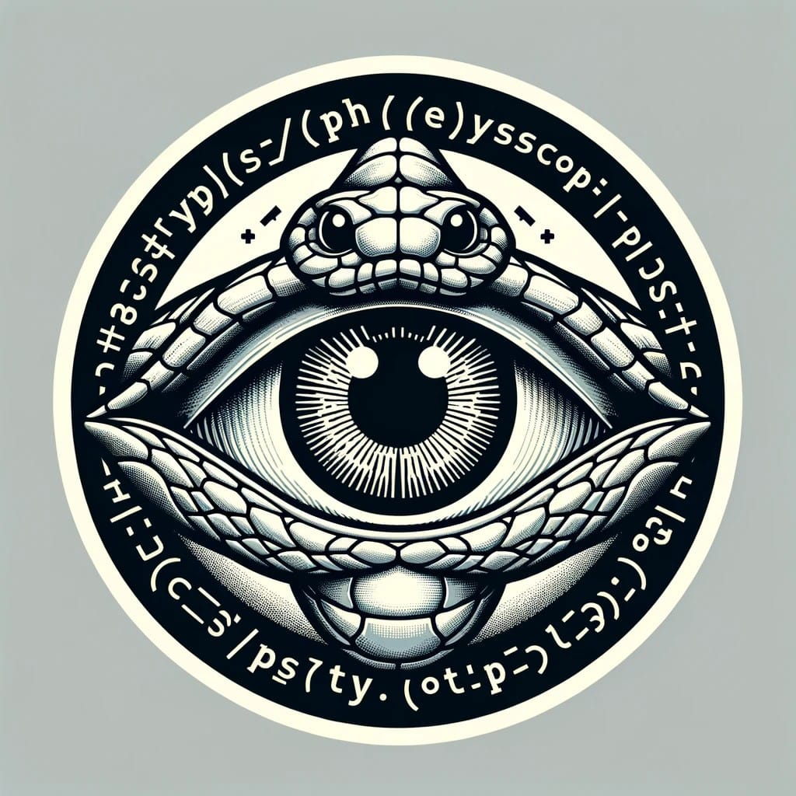

**ByakuganVisualizer** is a Python tool for comparing images, highlighting visual differences, and applying color filters.

I have a mix of deuteranomaly and protanomaly, which motivated me to create this repository!
Now I can solve every colorblind test.

## Features

- Compare two images and generate a difference image
- Apply red, green, blue, or yellow channel filters
- Apply deuteranomaly and protanomaly correction
- Process one or multiple images from the command line
- Use the functionality directly from Python

## Notes on Color Correction

The deuteranomaly and protanomaly values control the strength of the correction.

Example:

```bash
byakugan_vision --images "tests/test_images/naruto.jpg" --deuteranomaly 2 --protanomaly 2
```

The algorithm is based on the following paper:

https://arxiv.org/abs/1711.10662

Correction in this context means that the image colors are adjusted to make differences more distinguishable for people with color vision deficiencies.

### Deuteranomaly Correction

```bash
byakugan_vision --images "tests/test_images/color_blind_test.jpg" --deuteranomaly 2
```

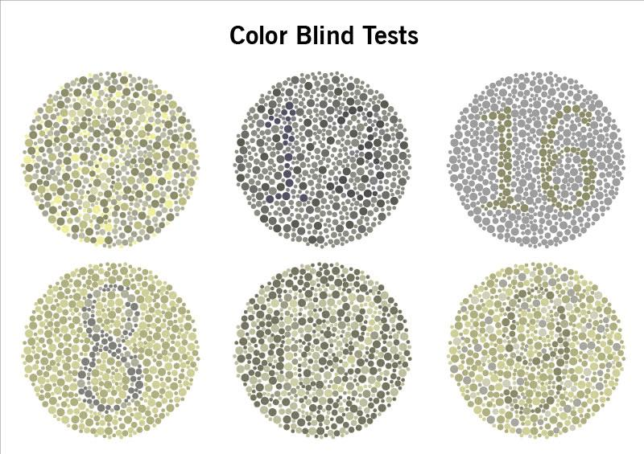

### Protanomaly Correction

```bash
byakugan_vision --images "tests/test_images/color_blind_test.jpg" --protanomaly 2
```

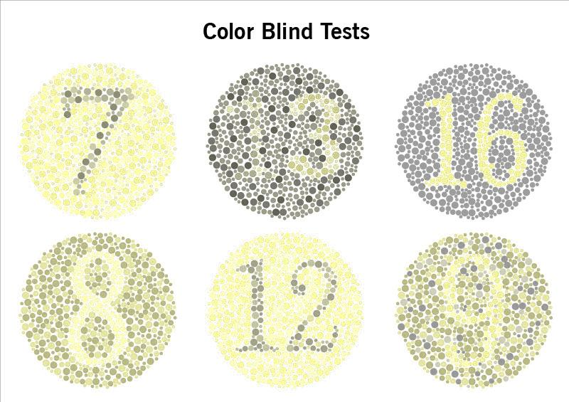

### Deuteranomaly and Protanomaly Correction

```bash
byakugan_vision --images "tests/test_images/color_blind_test.jpg" --deuteranomaly 2 --protanomaly 2
```

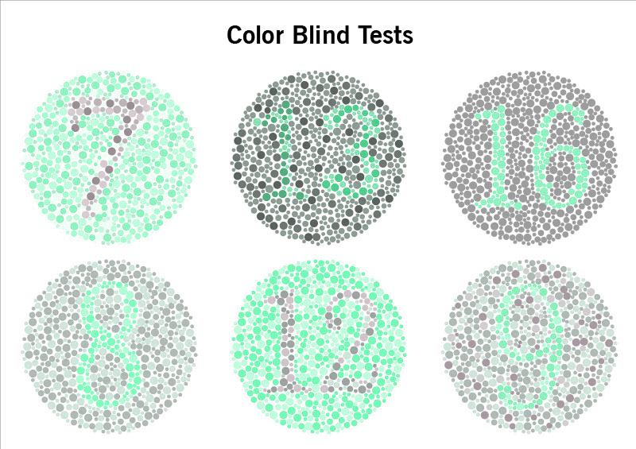

```bash
byakugan_vision --images "tests/test_images/color_blind_test.jpg" --deuteranomaly 0.5 --protanomaly 0.5
```

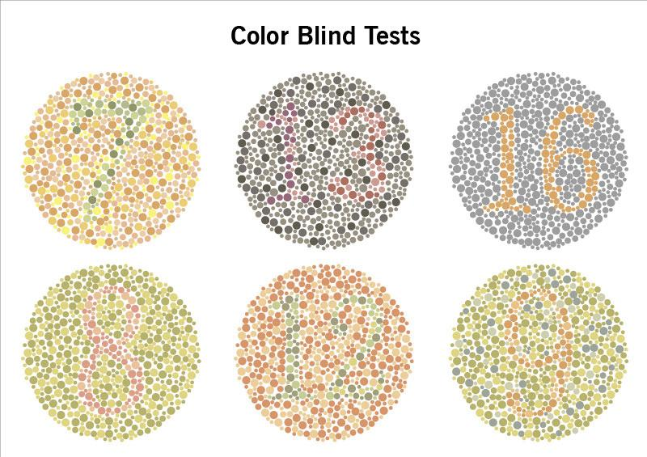


## Installation

```bash
pip install byakuganvisualizer
```

For local development:

```bash
git clone https://github.com/HokageM/ByakuganVisualizer.git
cd ByakuganVisualizer
pip install -e .
```

## Usage

### Command Line Interface

```bash
byakugan_vision --help
```

```text
usage: byakugan_vision [-h] [--version]
                       (--diff DIFF | --images IMAGES)
                       [--filter {red,blue,green,yellow}]
                       [--deuteranomaly DEUTERANOMALY]
                       [--protanomaly PROTANOMALY]
                       [--out_dir OUT_DIR]

ByakuganVisualizer: Tool for correcting the color palette for color-blind users
and highlighting differences between images.

options:
  -h, --help            show this help message and exit
  --version             show program's version number and exit

processing mode:
  --diff DIFF           Image pairs to compare.
                        Format:
                        "Path_To_Image1a,Path_To_Image2a;Path_To_Image1b,Path_To_Image2b"
  --images IMAGES       Comma-separated list of image paths to process.
                        Example:
                        "image_a.jpg,image_b.jpg,image_c.jpg"

filter options:
  --filter {red,blue,green,yellow}
                        Filter type to apply.
  --deuteranomaly DEUTERANOMALY
                        Degree of deuteranomaly correction. Default is 0.
  --protanomaly PROTANOMALY
                        Degree of protanomaly correction. Default is 0.

output options:
  --out_dir OUT_DIR     Output directory for generated images. Default is current directory.
```

`--diff` and `--images` are mutually exclusive. Use one or the other.

## Examples

### Filter an Image

```bash
byakugan_vision --images "tests/test_images/naruto.jpg" --filter red
```

Output:

```text
Filtered_naruto_red.jpg
```

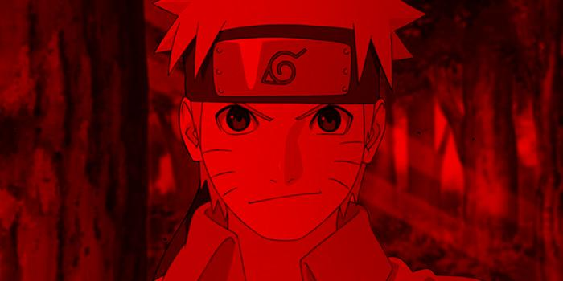

### Process Multiple Images

```bash
byakugan_vision --images "tests/test_images/naruto.jpg,tests/test_images/naruto_modified.jpg" --filter blue
```

### Deuteranomaly Correction

```bash
byakugan_vision --images "tests/test_images/naruto.jpg" --deuteranomaly 2
```

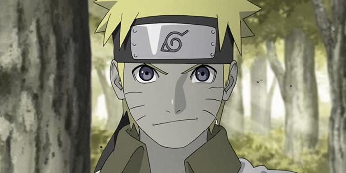

### Protanomaly Correction

```bash
byakugan_vision --images "tests/test_images/naruto.jpg" --protanomaly 2
```

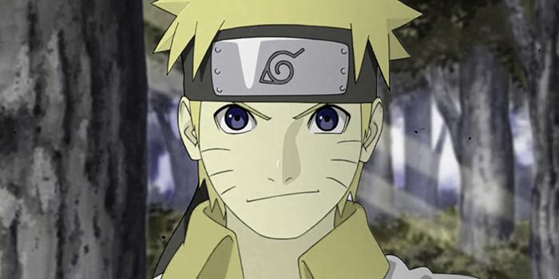

### Deuteranomaly and Protanomaly Correction

```bash
byakugan_vision --images "tests/test_images/naruto.jpg" --deuteranomaly 2 --protanomaly 2
```

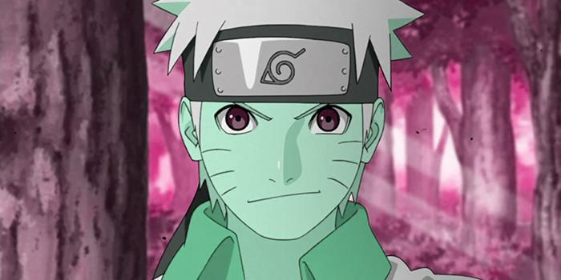

```bash
byakugan_vision --images "tests/test_images/naruto.jpg" --deuteranomaly 0.5 --protanomaly 0.5
```

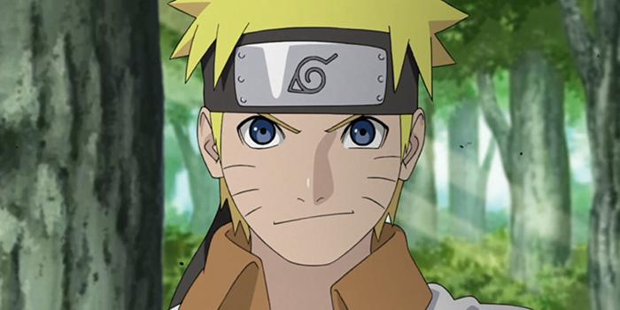

## Differences Between Images

The left image used in this example is from the following source:

https://www.anime2you.de/news/606180/naruto-feiert-20-anime-jubilaeum/

<div style="display: flex; flex-direction: row;">
    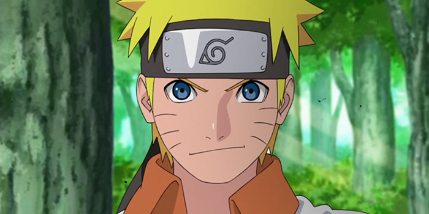
    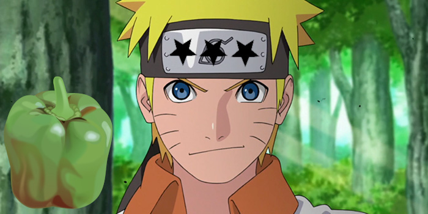
</div>

### Difference Without Filter

```bash
byakugan_vision --diff "tests/test_images/naruto.jpg,tests/test_images/naruto_modified.jpg" --out_dir tests/test_images/diff
```

Output:

```text
Diff_naruto_naruto_modified.jpg
```

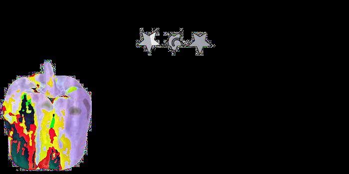

### Difference With Filter

```bash
byakugan_vision --diff "tests/test_images/naruto.jpg,tests/test_images/naruto_modified.jpg" --filter red --out_dir tests/test_images/diff
```

Output:

```text
Diff_naruto_naruto_modified_red.jpg
```

## Python API

The refactored API uses `ByakuganProcessor` as the main processing class:

```python
from byakuganvisualizer.processor import ByakuganProcessor

processor = ByakuganProcessor(
    out_dir="tests/test_images/filtered",
    filter_name="red",
)

processor.process_image("tests/test_images/naruto.jpg")
```

### Process Multiple Images

```python
from byakuganvisualizer.processor import ByakuganProcessor

processor = ByakuganProcessor(
    out_dir="tests/test_images/filtered",
    filter_name="blue",
)

processor.process_images(
    [
        "tests/test_images/naruto.jpg",
        "tests/test_images/naruto_modified.jpg",
    ]
)
```

### Calculate a Difference Image

```python
from byakuganvisualizer.processor import ByakuganProcessor

processor = ByakuganProcessor(out_dir="tests/test_images/diff")

processor.calculate_diff(
    "tests/test_images/naruto.jpg",
    "tests/test_images/naruto_modified.jpg",
)
```

### Calculate Multiple Difference Images

```python
from byakuganvisualizer.processor import ByakuganProcessor

processor = ByakuganProcessor(out_dir="tests/test_images/diff")

processor.calculate_diffs(
    [
        (
            "tests/test_images/naruto.jpg",
            "tests/test_images/naruto_modified.jpg",
        ),
    ]
)
```

## Byakugan

The [Byakugan](https://naruto.fandom.com/wiki/Byakugan) from *Naruto* is a powerful ability that allows users to see through objects, detect chakra, and perceive long distances.

This project uses the name as a metaphor for making visual differences easier to see.

## License

This project is licensed under the MIT License. See the [LICENSE](LICENSE) file for details.