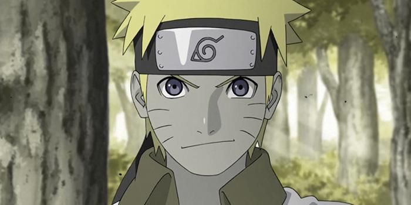
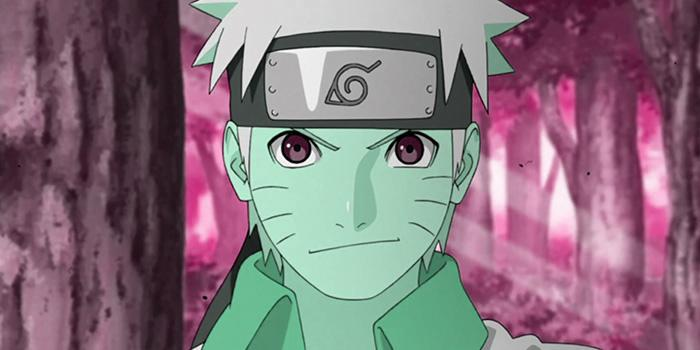
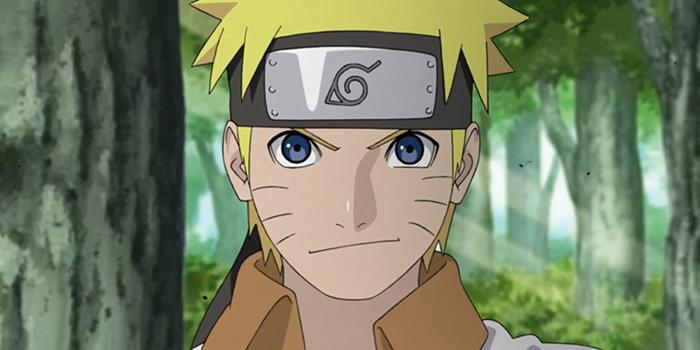
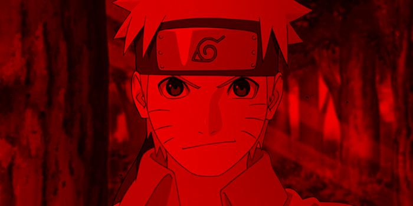

# ByakuganVisualizer


The ByakuganVisualizer repository hosts a Python tool designed to compare images and highlight their differences.
It simplifies the process of identifying disparities between images, making it ideal for tasks like testing and quality 
assurance.
Moreover, it offers a color filter that can be used to correct images for **color-blind users**.


## Installation

```bash
pip install byakuganvisualizer
```

## Usage 

```
usage: byakugan_vision [-h] [--version] [--diff DIFF] [--filter {red,blue,green,yellow}] [--images IMAGES] [--deuteranomaly DEUTERANOMALY]
                       [--protanomaly PROTANOMALY] [--out_dir OUT_DIR]

ByakuganVisualizer: Tool for correcting the color palett for color blind people and highlighting differences of images.

options:
  -h, --help            show this help message and exit
  --version             show program's version number and exit
  --diff DIFF           String containing a list of tuples "Path_To_Image1a,Path_To_Image2a;Path_To_Image1b,Path_To_Image2b...". Each tuple
                        contains two paths to images to be compared.
  --filter {red,blue,green,yellow}
                        Filter type (red, blue, green, yellow)
  --images IMAGES       List of image names to be manipulated by a filter. E.g.: A,B,C,D
  --deuteranomaly DEUTERANOMALY
                        Expresses your degree of deuteranomaly, which will be used to correct the image. Default is 1.
  --protanomaly PROTANOMALY
                        Expresses your degree of protanomaly, which will be used to correct the image. Default is 1.
  --out_dir OUT_DIR     Output directory for the difference images
```

## Image Correction for Color Blind People

In the following examples the image is corrected for deuteranomaly and protanomaly. 

**Note:** The float values for deuteranomaly and protanomaly are between 0 and 10. The default value is 1.
The used algorithm is based on the following paper: https://arxiv.org/abs/1711.10662.

The image used in the example is from the following source:
https://www.anime2you.de/news/606180/naruto-feiert-20-anime-jubilaeum/


### Deuteranomaly Correction

```bash
byakugan_vision --images "tests/test_images/naruto.jpg" --deuteranomaly 2
```



### Protanomaly Correction

```bash
byakugan_vision --images "tests/test_images/naruto.jpg" --protanomaly 2
```


### Deuteranomaly and Protanomaly Correction

```bash
byakugan_vision --images "tests/test_images/naruto.jpg" --deuteranomaly 2 --protanomaly 2
```




```bash
byakugan_vision --images "tests/test_images/naruto.jpg" --deuteranomaly 0.5 --protanomaly 0.5
```



### Filter an Image

```bash
byakugan_vision --images "tests/test_images/naruto.jpg" --filter red
```




## Differences between images

The left image used in the example is from the following source:
https://www.anime2you.de/news/606180/naruto-feiert-20-anime-jubilaeum/

<div style="display: flex; flex-direction: row;">
    
    
</div>

### Difference with no Filter

```bash
byakugan_vision --diff "tests/test_images/naruto.jpg,tests/test_images/naruto_modified.jpg" --out_dir tests/test_images/diff
```


Note: The output depends on the order of the images in the tuple. The first image is subtracted from the second image.
That is why the following command results in a different output:

```bash
byakugan_vision --diff "tests/test_images/naruto_modified.jpg,tests/test_images/naruto.jpg" --out_dir tests/test_images/diff
```


### Red Filtered Difference

```bash
byakugan_vision --diff "tests/test_images/naruto.jpg,tests/test_images/naruto_modified.jpg" --filter red --out_dir tests/test_images/diff
```


### Blue Filtered Difference

```bash
byakugan_vision --diff "tests/test_images/naruto.jpg,tests/test_images/naruto_modified.jpg" --filter blue --out_dir tests/test_images/diff
```


### Green Filtered Difference

```bash
byakugan_vision --diff "tests/test_images/naruto.jpg,tests/test_images/naruto_modified.jpg" --filter green --out_dir tests/test_images/diff
```


### Yellow Filtered Difference

```bash
byakugan_vision --diff "tests/test_images/naruto.jpg,tests/test_images/naruto_modified.jpg" --filter yellow --out_dir tests/test_images/diff
```

